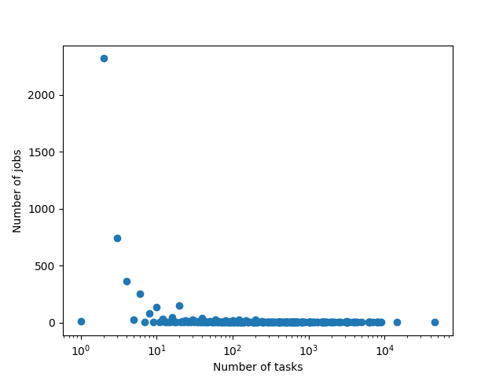
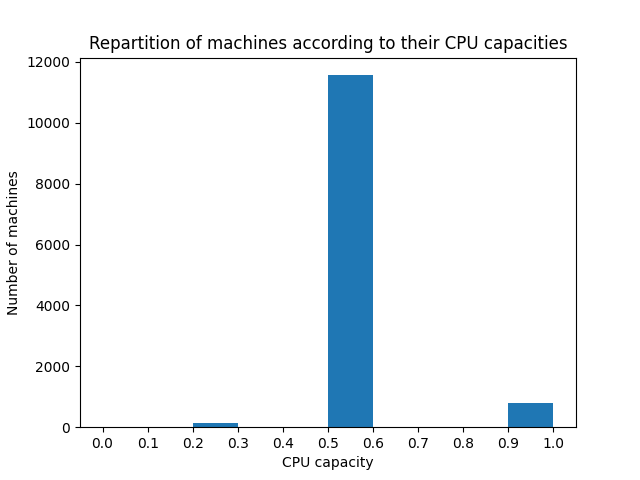
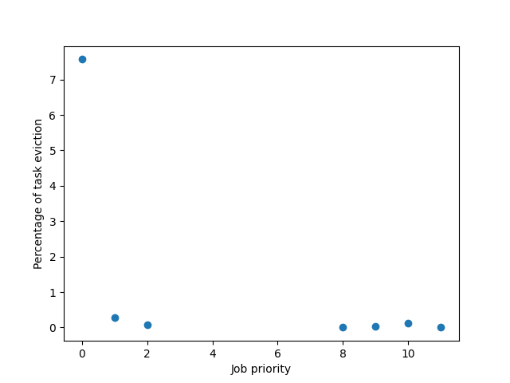
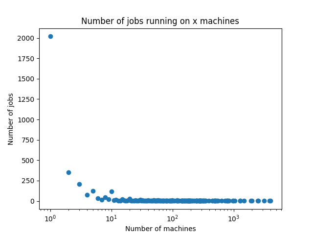

# Spark Lab

## Students

Bastien Exertier & Louis Boulanger

## Analysis

### Reading of the data

I decided to divide my code into blocks that could be executed in any order. So, at the begining of every block I open every data file that I need for my analysis, even if I already did in another analysis.
```python
entries = sc.textFile("./data/machine-events.csv").map(csv_split)
```
with `csv_split` being :
```python
def csv_split(line):
	return line.split(',')
```

As it comes to indexes and enum types, I decided to define everything in variables. This is probably not the best way to do it, but it is very readable and easy to understand.

For example :
```python
ADD, REMOVE, UPDATE = 0, 1, 2
TIME, MACHINEID, EVENTTYPE, PLATID, CPUS, MEM = [i for i in range(6)]
NDIVISIONS = 10
```

### How many tasks compose a job

#### Method

To conduct this analysis, we use the task event table. Then we :
* Group by job ID
* Map the `len` function over, which would return the number of tasks.
* Compute the mean.

#### Code

```python
task_per_job = entries.groupBy(
	lambda task: task[JOBID]
).map(
	lambda job_task: len(job_task[1])
)

print(f'on average, jobs have {round(task_per_job.mean(), 1)} tasks')
```

#### Results

* On average, a job is made of 92 tasks.
* However, when we plot the number of jobs for each number of tasks, we get this :

* We can see that :
	* There is a huge number of jobs that have only a few tasks.
	* The is a small amount of jobs that have a huge amount of tasks.

### Computational power loss due to maintenance

To conduct this analysis, I used the machine event table.

#### Method

* We first need to know the time span of the table, so we need the maximum time in the table :
```python
maxtime = entries.map(lambda event: int(event[TIME])).max()
```

* First, we remove every `UPDATE` events and events happening at 0.
* Then we map every line to a couple of `(machine ID, (event time, event type))`.
* Then, for each machine we want to know the amount of time a machine was down, so we sum the `event times` positively if the event was an `ADD` event and negatively if it was a `REMOVE` event. In order to do that, we use the `aggregate` method.
* Finally, at the end some of the value in the list are negative, meaning that some machine were removed and not added back at the end of the table. To solve that, we add a fake `ADD` event at `maxtime` using the `map` method.

#### Code

```python
time_lost = entries.filter(
	# we remove the firsts ADD events (<=> happening at 0)
	# and the UPDATE events
	lambda event: int(event[0]) != 0 and int(event[EVENTTYPE]) != UPDATE
).map(
	# (machine ID, (eventtime, eventtype))
	lambda event: (
		event[MACHINEID],
		(int(event[TIME]), int(event[EVENTTYPE]))
	)
).aggregateByKey(
	# we sum the timestamps
	# positively if its an ADD, else negatively
	0,
	lambda acc, event: acc + {
		ADD: event[TIME],
		REMOVE: -event[TIME]
	}[event[MACHINEID]],
	add
).map(
	# if the sum is negative that means the machine is REMOVED at 
	# the end of the data. In that case we add an artificial
	# add event at maxtime
	lambda total: (total[0], maxtime + total[1] if total[1] < 0 else total[1])
)
```

This gives the absolute time lost for every machine which is difficult to make sense, so we convert the time lost in a percentage of the total time (maxtime) and then we print the mean.

```python
percentage_lost = time_lost.map(
	# we change the sum to a percentage of maxtime
	lambda total: 100*total[1]/maxtime
)

print(f'On average, each machine is down for\
 {percentage_lost.mean()}% of the time')
```

#### Results

We can see that, on average, machine are down *2%* of the time.

### Distribution of machine according to CPU

#### Method

To conduct this analysis, we use the machine event table. Then we :
* Use the `filter` method to only keep the first ADD events so we only see each machine once. 
* Map every line to keep only the CPU value.
* Use the `histogram` method to aggregate the values into buckets in order to make a readable graph.

We want to aggregate into a list to be able to plot a histogram. The list contains `NDIVISIONS` cells. The `ith` cells contains the number of machine having a CPU capacity between `i/NDIVISIONS` and `(i+1)/NDIVISIONS`.

#### Code

```python
cpus = entries.filter(
	# we only keep ADD event at the begining
	# this ensure that every machine is taken once
	lambda event: int(event[EVENTTYPE]) == ADD and int(event[TIME]) == 0
).map(
	# we only keep the cpu number
	lambda event: float(event[CPUS])
).histogram([i/NDIVISIONS for i in range(NDIVISIONS + 1)])
```

#### Results

*Repartition of machines according to their CPU capacities*


* We can see an overwelming majority of machine having CPU capacities of half the max capacity.
* A small amount of machines have a CPU capacity of 1.
* The rests of the CPU capacity are not represented in machines.

### Probablity of eviction according to priority

In order to conduct this analysis, we want to plot the average of number of tasks eviction as a function of their priority.

#### Method

* First we need the number of tasks. To to that, we filter to keep only the `SUBMIT` events, grouped by the priority of the task.
```python
submits_by_key = entries.filter(
	lambda event: int(event[EVENTTYPE]) == SUBMIT
).map(
	lambda event: (int(event[PRORITY]), 1)
).reduceByKey(add)

```

* Secondly, we do the same for the `EVICT`.
```python
evictions_by_key = entries.filter(
	# We only keep the EVICT events
	lambda event: int(event[EVENTTYPE]) == EVICT 
).map(
	# we change the key to the priority for the grouping
	lambda event: (int(event[PRORITY]), 1)
).reduceByKey(
	 # we reduce by key using the add operator
	add
)
```

> Now that the lists are really small, we can do some work in regular, sequential python.

* Then, we create a set of `(priority, number of tasks being evicted)`
```python
evictions = {
	priority: evictions
	for priority, evictions in evictions_by_key.collect()
}
```

* Finally, we create a list percentages of evictions per priority
```python
evictions_pr = sorted(
	# list of priority and percentage of eviction per submit 
	# 200% => on average, task of this priority get evicted 2 times
	[
		(priority, round(100*evictions.get(priority, 0) / submit, 2))
		for priority, submit in submits_by_key.collect()
	],
	# sorted by priority
	key=lambda x: x[0]
)
```

#### Results

*Percentage of evictions per task, as a function of the priority of its job*


* We can see that the tasks of priority 0 are far more likely to get evicted than tasks with greater priorities.
* However, for tasks of priorities greater than 0, the priority of the job doesn't seem to affect the percentage of evictions.

### Repartition of job tasks on machine

#### Method

* First we open the task events table.
* We `filter` out the rows with a null `job ID` or `machine ID` and only keep the `SUBMIT` events.
* Then we `map` each event to `(job ID, machine ID)`
* We `groupByKey` (by job ID)
* We `map` every element to the number of different machines

#### Code

```python
nb_of_machine_per_job = entries.filter(
	# we only keep SUBMIT events that have non null jobid and machineid
	lambda event: (
		int(event[EVENTTYPE]) == SUBMIT and
		event[JOBID] and event[MACHINEID]
	)
).map(
	# we change the data to (jobid, machineid)
	lambda event: (int(event[JOBID]), int(event[MACHINEID]))
).groupByKey(
	# we group the set by jobid
).map(
	# we get the number of distinct machine for each job
	lambda job: len(set(job[1]))
)
```

#### Results

* 2019 jobs are using exactly 1 machine.
* 1482 jobs are using more than 1 machine.
* On average, a job uses 24 differents machines.



* We can see that most of the jobs are using a few or only one machine.
* We can see that the rest of the jobs are taking from 10 to 40 000 different machines.

> Those results seem to be coherent with the *how many tasks compose a job" results.