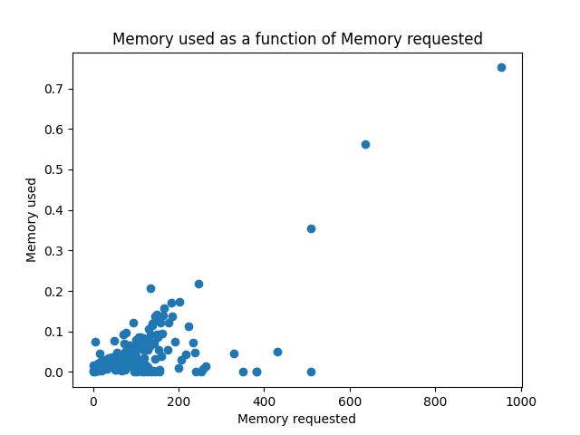
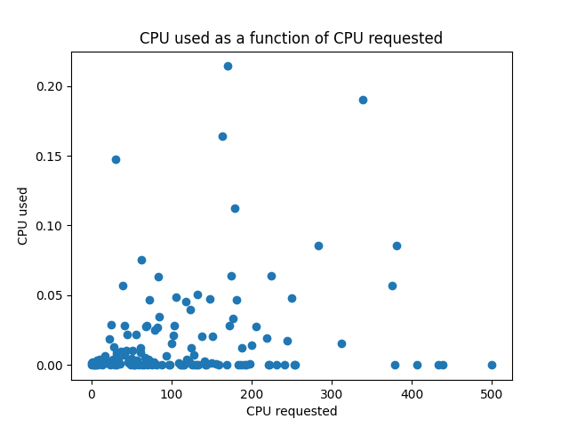
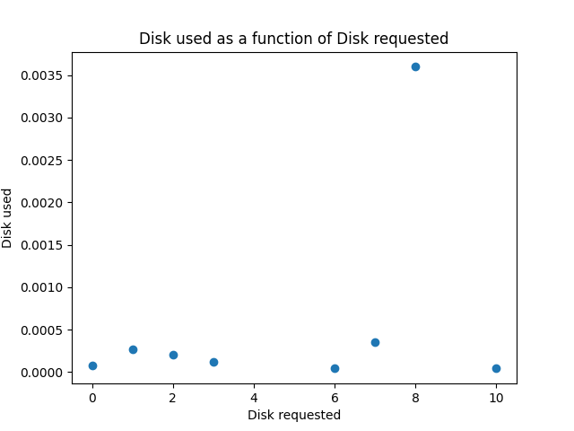
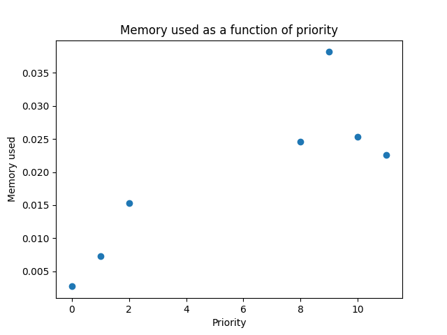
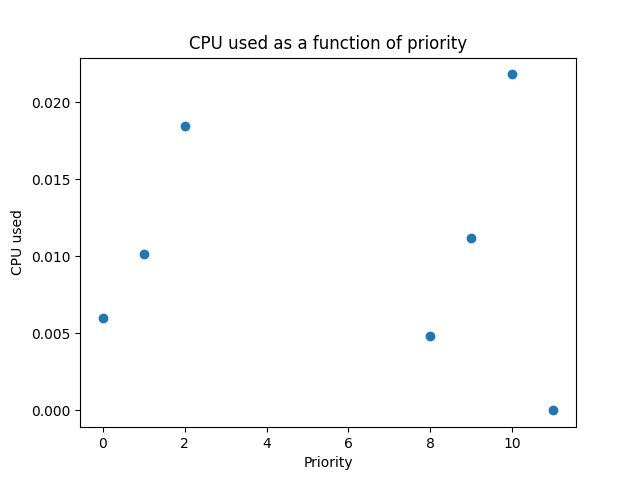
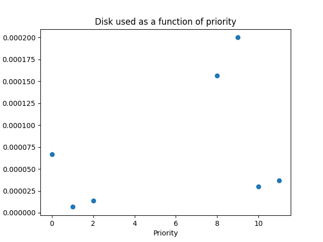
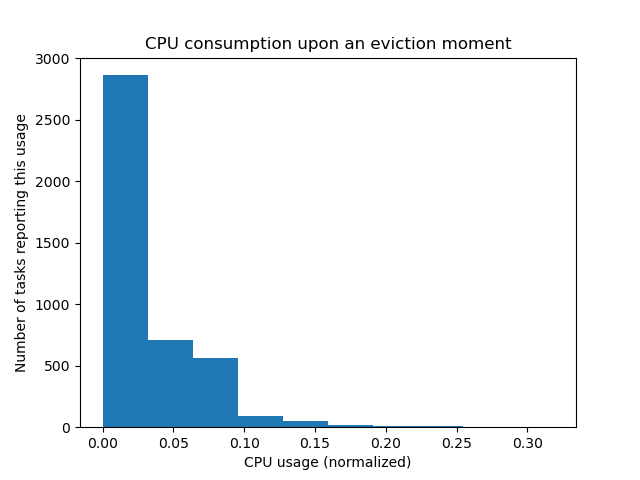
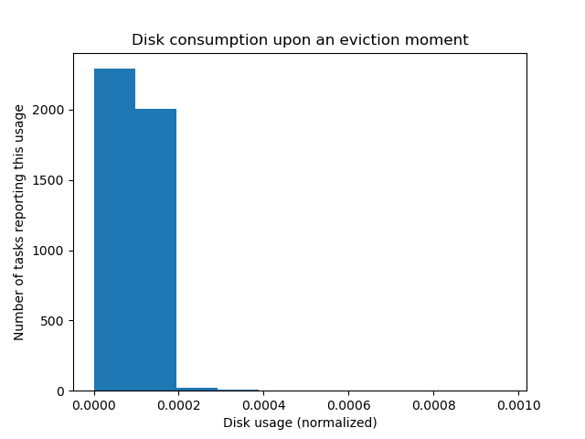

# Spark Lab

## Students

Bastien Exertier & Louis Boulanger

## Analysis

### Reading of the data

I decided to divide my code into blocks that could be executed in any order. So, at the begining of every block I open every data file that I need for my analysis, even if I already did in another analysis.
```python
entries = sc.textFile("./data/machine-events.csv").map(csv_split)
```
with `csv_split` being :
```python
def csv_split(line):
	return line.split(',')
```

As it comes to indexes and enum types, I decided to define everything in variables. This is probably not the best way to do it, but it is very readable and easy to understand.

For example :
```python
ADD, REMOVE, UPDATE = 0, 1, 2
TIME, MACHINEID, EVENTTYPE, PLATID, CPUS, MEM = [i for i in range(6)]
NDIVISIONS = 10
```

### How many tasks compose a job

#### Method

To conduct this analysis, we use the task event table. Then we :
* Group by job ID
* Map the `len` function over, which would return the number of tasks.
* Compute the mean.

#### Code

```python
task_per_job = entries.groupBy(
	lambda task: task[JOBID]
).map(
	lambda job_task: len(job_task[1])
)

print(f'on average, jobs have {round(task_per_job.mean(), 1)} tasks')
```

#### Results

* On average, a job is made of 92 tasks.
* However, when we plot the number of jobs for each number of tasks, we get this :

* We can see that :
	* There is a huge number of jobs that have only a few tasks.
	* The is a small amount of jobs that have a huge amount of tasks.

### Computational power loss due to maintenance

To conduct this analysis, I used the machine event table.

#### Method

* We first need to know the time span of the table, so we need the maximum time in the table :
```python
maxtime = entries.map(lambda event: int(event[TIME])).max()
```

* First, we remove every `UPDATE` events and events happening at 0.
* Then we map every line to a couple of `(machine ID, (event time, event type))`.
* Then, for each machine we want to know the amount of time a machine was down, so we sum the `event times` positively if the event was an `ADD` event and negatively if it was a `REMOVE` event. In order to do that, we use the `aggregate` method.
* Finally, at the end some of the value in the list are negative, meaning that some machine were removed and not added back at the end of the table. To solve that, we add a fake `ADD` event at `maxtime` using the `map` method.

#### Code

```python
time_lost = entries.filter(
	# we remove the firsts ADD events (<=> happening at 0)
	# and the UPDATE events
	lambda event: int(event[0]) != 0 and int(event[EVENTTYPE]) != UPDATE
).map(
	# (machine ID, (eventtime, eventtype))
	lambda event: (
		event[MACHINEID],
		(int(event[TIME]), int(event[EVENTTYPE]))
	)
).aggregateByKey(
	# we sum the timestamps
	# positively if its an ADD, else negatively
	0,
	lambda acc, event: acc + {
		ADD: event[TIME],
		REMOVE: -event[TIME]
	}[event[MACHINEID]],
	add
).map(
	# if the sum is negative that means the machine is REMOVED at 
	# the end of the data. In that case we add an artificial
	# add event at maxtime
	lambda total: (total[0], maxtime + total[1] if total[1] < 0 else total[1])
)
```

This gives the absolute time lost for every machine which is difficult to make sense, so we convert the time lost in a percentage of the total time (maxtime) and then we print the mean.

```python
percentage_lost = time_lost.map(
	# we change the sum to a percentage of maxtime
	lambda total: 100*total[1]/maxtime
)

print(f'On average, each machine is down for\
 {percentage_lost.mean()}% of the time')
```

#### Results

We can see that, on average, machine are down *2%* of the time.

### Distribution of machine according to CPU

#### Method

To conduct this analysis, we use the machine event table. Then we :
* Use the `filter` method to only keep the first ADD events so we only see each machine once. 
* Map every line to keep only the CPU value.
* Use the `histogram` method to aggregate the values into buckets in order to make a readable graph.

We want to aggregate into a list to be able to plot a histogram. The list contains `NDIVISIONS` cells. The `ith` cells contains the number of machine having a CPU capacity between `i/NDIVISIONS` and `(i+1)/NDIVISIONS`.

#### Code

```python
cpus = entries.filter(
	# we only keep ADD event at the begining
	# this ensure that every machine is taken once
	lambda event: int(event[EVENTTYPE]) == ADD and int(event[TIME]) == 0
).map(
	# we only keep the cpu number
	lambda event: float(event[CPUS])
).histogram([i/NDIVISIONS for i in range(NDIVISIONS + 1)])
```

#### Results

*Repartition of machines according to their CPU capacities*


* We can see an overwelming majority of machine having CPU capacities of half the max capacity.
* A small amount of machines have a CPU capacity of 1.
* The rests of the CPU capacity are not represented in machines.

### Probablity of eviction according to priority

In order to conduct this analysis, we want to plot the average of number of tasks eviction as a function of their priority.

#### Method

* First we need the number of tasks. To to that, we filter to keep only the `SUBMIT` events, grouped by the priority of the task.
```python
submits_by_key = entries.filter(
	lambda event: int(event[EVENTTYPE]) == SUBMIT
).map(
	lambda event: (int(event[PRORITY]), 1)
).reduceByKey(add)

```

* Secondly, we do the same for the `EVICT`.
```python
evictions_by_key = entries.filter(
	# We only keep the EVICT events
	lambda event: int(event[EVENTTYPE]) == EVICT 
).map(
	# we change the key to the priority for the grouping
	lambda event: (int(event[PRORITY]), 1)
).reduceByKey(
	 # we reduce by key using the add operator
	add
)
```

> Now that the lists are really small, we can do some work in regular, sequential python.

* Then, we create a set of `(priority, number of tasks being evicted)`
```python
evictions = {
	priority: evictions
	for priority, evictions in evictions_by_key.collect()
}
```

* Finally, we create a list percentages of evictions per priority
```python
evictions_pr = sorted(
	# list of priority and percentage of eviction per submit 
	# 200% => on average, task of this priority get evicted 2 times
	[
		(priority, round(100*evictions.get(priority, 0) / submit, 2))
		for priority, submit in submits_by_key.collect()
	],
	# sorted by priority
	key=lambda x: x[0]
)
```

#### Results

*Percentage of evictions per task, as a function of the priority of its job*


* We can see that the tasks of priority 0 are far more likely to get evicted than tasks with greater priorities.
* However, for tasks of priorities greater than 0, the priority of the job doesn't seem to affect the percentage of evictions.

### Repartition of job tasks on machine

#### Method

* First we open the task events table.
* We `filter` out the rows with a null `job ID` or `machine ID` and only keep the `SUBMIT` events.
* Then we `map` each event to `(job ID, machine ID)`
* We `groupByKey` (by job ID)
* We `map` every element to the number of different machines

#### Code

```python
nb_of_machine_per_job = entries.filter(
	# we only keep SUBMIT events that have non null jobid and machineid
	lambda event: (
		int(event[EVENTTYPE]) == SUBMIT and
		event[JOBID] and event[MACHINEID]
	)
).map(
	# we change the data to (jobid, machineid)
	lambda event: (int(event[JOBID]), int(event[MACHINEID]))
).groupByKey(
	# we group the set by jobid
).map(
	# we get the number of distinct machine for each job
	lambda job: len(set(job[1]))
)
```

#### Results

* 2019 jobs are using exactly 1 machine.
* 1482 jobs are using more than 1 machine.
* On average, a job uses 24 differents machines.


* We can see that most of the jobs are using a few or only one machine.
* We can see that the rest of the jobs are taking from 10 to 40 000 different machines.

> Those results seem to be coherent with the **how many tasks compose a job** results.

### Are the tasks that request the more resources the one that consume the more resources?

#### Method

The **resource request** is in the **ask-event** table and the **resource usage** is in the **task-usage** table.
Task are linked by their **JobID** and by their **task index**.
Thus, we will need to join the two table by **(JobID, task index)**.
* First we filter the data such that we only keep **SUBMIT** and **UPDATE RUNNONG** events.
* We also only keep events where the resources request are defined.
* We transform the two tables so each row is like `(JobID, task index), (mem, cpu, disk)` with `mem`, `cpu`, `disk` being either the request (task events) or the usage (task usage).
* Then we can join the two table by **(JobID, task index)**.
* Then for each resource :
	* We transform the table into a list of couple **(res request, res usage)**.
	* Because we can't plot all the data (way too big), we need to find a way to reduce the number of points without losing too much information.
	* Our solution is to group resource usage in resource request intervals, and then to plot the average of each interval.
	* To do that, we change the `resource request` by `round(NDIVISIONS*res[REQUEST]`.
	* We then use `aggregateByKey` to compute the average on each interval.
	* We can finally plot the data.

#### Code

##### Filtering and Mapping

Filtering out useless data, and mapping to `(JobID, task index), (mem, cpu, disk)`.

```python
request = tasks.filter(
	# We filter to only keep :
	# - submit and update running events
	# - events where the cpu, mem, and disk request are non null
	lambda task: 
		int(task[EVENTTYPE]) in (SUBMIT, UPDATE_RUNNING) and
		task[CPU_REQ] and task[MEM_REQ] and task[DISK_REQ]
).map(
	# we map the list into (JOBID, (resources requests))
	lambda task: (
		(int(task[JOBID]), int(task[TASKINDEX])),
		(task[MEM_REQ], task[CPU_REQ], task[DISK_REQ])
	)
)

usage = usage.map(
	# we map the usage table the same way as we did on the event,
	# replacing resources requests by resources usages
	lambda task: (
		(int(task[JOBID]), int(task[TASKINDEX])),
		(task[MAXMEM_USAGE], task[CPU_USAGE], task[DISK_USAGE])
	)
)
```

##### Join

```python
usage_over_requested = request.join(usage)
```

##### resource

Mapping the data to a list of ratio of a specific resource.

```python
def resources_ratio(resources, res_type):
	""" select a resource type from resources """
	return resources.map(
		lambda task: (
			float(task[TASK][REQUEST][res_type]),
			float(task[TASK][USAGE][res_type])
		)
	)
```

Groupping over intervals of resource requested, and computing average of each interval.

```python
def resources_intervals(resources):
	""" transform a list of usage over request into intervals """
	return resources.map(
		lambda res: (round(NDIVISIONS*res[REQUEST]), res[USAGE])
	).aggregateByKey(
		# we now compute the average in each interval
		# (sum, count)
		(0, 0),
		# (sum, count) = (sum + current, count + 1)
		lambda acc, curr: (acc[0] + curr, acc[1] + 1),
		# merge (sum, count) = (sum1 + sum2, count1 + count2)
		lambda a, b: (a[0] + b[0], a[1] + b[1])
	).map(
		# we divide the sum by the count to have the average
		lambda res: (res[REQUEST], res[USAGE][0]/res[USAGE][1])
	)
```

Plotting the average of each interval.

```python
def resources_plot(intervals, res_name):
	""" plot a graph of resource usage over resource requested """
	plt.plot(*zip(*intervals.collect()), 'o')
	# plt.xscale('log')
	plt.title(f'{res_name} used as a function of {res_name} requested')
	plt.ylabel(f'{res_name} used')
	plt.xlabel(f'{res_name} requested')
	plt.show()
```

#### Results

##### Memory

We can see that the more a task request memory, the more it will use memory.
We can conclude that tasks that request the most amount of memory are the one that use the most.



##### CPU

We can't see an obvious link between the CPU usage and CPU request.



##### Disk

We can't see an obvious link between the Disk usage and Disk request.



### Is there a relation between the amount of resource consumed by tasks and their priority?

#### Method

The method to have a result is pretty similar to _Are the tasks that request the more resources the one that consume the more resources?_ but instead plotin the usage as a function of the request, we plot it as a function of the priotity.  
Since we use the priority for the Memory, CPU and Disk, we can do the averages all at once.

#### Code

##### Filtering

We do some filtering on the table (similar to the previous question).

```python
request = tasks.filter(
	# We filter to only keep :
	# - submit and update running events
	# - priority is non null
	lambda task: 
		int(task[EVENTTYPE]) in (SUBMIT, UPDATE_RUNNING) and task[PRORITY]
).map(
	# we map the list into (JOBID, (resources requests))
	lambda task: (
		(int(task[JOBID]), int(task[TASKINDEX])), int(task[PRORITY])
	)
)

usage = usage.map(
	lambda task: (
		(int(task[JOBID]), int(task[TASKINDEX])),
		(task[MAXMEM_USAGE], task[CPU_USAGE], task[DISK_USAGE])
	)
)
```

##### Join

```python
usage_over_priority = request.join(usage)
```

##### Aggregation

This time, we compute the intervals and averages of Memory, CPU, and Disk at the same time. Doing such will request only of aggregation instead of three.

```python
resource_averages = usage_over_priority.map(
	# Because we don't need the jobID or task index anymore,
	# We only keep the value of the key-value pair
	lambda res: res[DATA]
).aggregateByKey(
	# Aggregate by priority, (sum(usage), count(usage))
	((0, 0, 0), 0),
	# Adding new task usage to the accumulator
	lambda acc, curr: (
		(
			acc[SUM][MEM] + float(curr[MEM]),
			acc[SUM][CPU] + float(curr[CPU]),
			acc[SUM][DISK] + float(curr[DISK]),
		), acc[COUNT] + 1
	),
	# Merging two accumulator together
	lambda a, b: (
		(
			a[SUM][MEM] + b[SUM][MEM],
			a[SUM][CPU] + b[SUM][CPU],
			a[SUM][DISK] + b[SUM][DISK],
		), a[COUNT] + b[COUNT]
	)
).map(
	# compute the average sum(usage)/count(usage)
	lambda res: (
		res[PRORITY], (
			res[USAGE][SUM][MEM]/res[USAGE][COUNT],
			res[USAGE][SUM][CPU]/res[USAGE][COUNT],
			res[USAGE][SUM][DISK]/res[USAGE][COUNT]
		)
	)
)
```

#### Results

##### Memory

Memory usage seems to be related to the priority. The higher the priority, the most amount of memory is used by the task.




##### CPU

We can't see an obvious link between the CPU usage and Priority.




##### Disk

We can't see an obvious link between the Disk usage and Priority.



### Can we observe correlations between peaks of high resource consumption on some machines and eviction events?

#### Method

The method to get the result is as follows: we get all the eviction
events by job, task and machine ID, and get all the usage data that is
linked to an eviction event. Then, we get the maximum usage for the
memory, CPU and disk, and aggregate the data into an histogram to get
the number of evictions event per usage on a given machine.

The goal is to see if the number of evictions correlate with a
higher-than-normal resource usage on the machines.

#### Code

##### Getting the eviction events and usages

```python
# Get all eviction events and have only the job id, task id and
# machine id
evictions = tasks.filter(
        lambda task: int(task[EVENT_TYPE]) == EVICT
).map(
        lambda task: (
                (int(task[JOB_ID]),int(task[TASK_ID]), int(task[MACHINE_ID])),
                None
        )
)

# Get the job, task and machine id, and the usages we're interested in
usage = usage.map(
	lambda task: (
		(int(task[JOB_ID]), int(task[TASK_ID]), int(task[MACHINE_ID])),
		(task[MAXMEM_USAGE], task[CPU_USAGE], task[DISK_USAGE])
	)
)
```

##### Getting the maximum peaks for each event

We first join the usage on the evictions by their job, task and
machine ID, so that each usage metric we get is tied to an eviction
event. Then, we aggregate the results by key, by taking the maximum
usage recorded for that particular event (taking the average would
hide a potential peak of consumption that would have triggered the
eviction).

```python
usage_for_evictions = evictions.join(usage).map(
        lambda x: (x[0], (x[1][1][MEM], x[1][1][CPU], x[1][1][DISK]))       
).aggregateByKey(
        # Aggregate by priority, (sum(usage), count(usage))
	(0, 0, 0),
	# Adding new task usage to the accumulator
	lambda acc, curr: (
		max(acc[MEM], float(curr[MEM])),
		max(acc[CPU], float(curr[CPU])),
		max(acc[DISK], float(curr[DISK])),
	)
	,
	# Merging two accumulator together
	lambda a, b: (
		max(a[SUM][MEM], b[SUM][MEM]),
		max(a[SUM][CPU], b[SUM][CPU]),
		max(a[SUM][DISK], b[SUM][DISK]),
	)
        
)
```

##### Getting the histograms

After getting the data, we then compute the histogram for each metric:
CPU, memory and disk.


### Results

The results we get here are partial: the usage metric we get is for
the corresponding task, not taking into account the other tasks
present on the machine at the time of the eviction. It could very well
be that the tasks are getting evicted because another task, with a
higher priority, needs more resources.

#### Memory

It doesn't look like high memory consumption is a significant trigger
of eviction events: the quasi-totaly of eviction events happen when
the maximum memory usage doesn't go higher than 4%.


#### CPU

The CPU usage graph shows a slightly high propention of evictions when
the usage is high. This could mean that there is a correlation between
the CPU consumption and the eviction of tasks.



#### Disk

There is clearly no correlation between disk usage and evictions.


